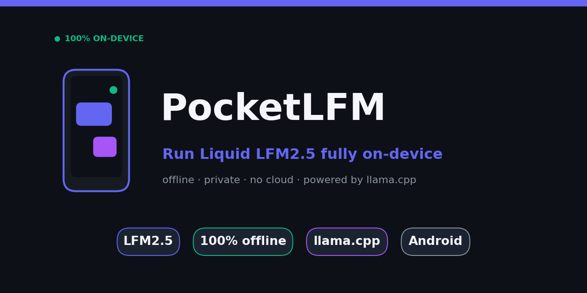

<div align="center">



# PocketLFM

### Run Liquid AI's LFM2.5 large language model **fully on-device** on Android — offline, private, no cloud.

<sub>on-device LLM · edge AI · LFM2.5 · Liquid Foundation Model · offline AI Android · llama.cpp Android · local LLM · private AI · GGUF · edge inference</sub>

[](https://www.android.com)
[](LICENSE)
[](https://github.com/ggerganov/llama.cpp)
[](https://huggingface.co/LiquidAI/LFM2.5-1.2B-Instruct-GGUF)
[]()

</div>

---

> ### 🏆 What makes this notable
> To our knowledge, **PocketLFM is the first independent open-source Android app that runs Liquid AI's LFM2.5 fully on-device via [llama.cpp](https://github.com/ggerganov/llama.cpp)** — outside Liquid AI's own [Apollo app](https://play.google.com/store/apps/details?id=ai.liquid.chatapp) and [LEAP SDK](https://leap.liquid.ai/).
>
> Liquid AI claims LFM2.5 is built for the edge and runs under 1 GB of memory. This app is an **open, llama.cpp-based reference implementation that demonstrates exactly that** — no proprietary SDK, just GGUF + native inference on your phone.

---

## 💡 What is PocketLFM?

PocketLFM is a native Android chat app that runs a real LLM — **Liquid AI's LFM2.5-1.2B-Instruct** — entirely on your device. No internet. No servers. No data ever leaves your phone.

It uses [llama.cpp](https://github.com/ggerganov/llama.cpp)'s C++ inference engine (via the Android NDK) with a modern Jetpack Compose UI. Because it speaks the GGUF format, it can also run **any** small GGUF model — TinyLlama, Phi, Llama 3.2, Gemma, etc. — but it ships pointed at LFM2.5, which is purpose-built for edge devices.

| | |
|---|---|
| 🔒 **100% offline** | Inference runs locally. Zero network calls for chat. |
| 🧠 **LFM2.5-1.2B** | Liquid AI's edge-optimized model, ~750 MB (Q4_K_M), <1 GB RAM |
| ⚡ **Native speed** | C++ / NDK backend via llama.cpp |
| 🎨 **Modern UI** | Jetpack Compose, MVVM, Hilt, Coroutines/Flow |
| 🔁 **Any GGUF** | Swap in any GGUF model with one URL change |
| 🛡️ **Private by design** | Chat history stays in the app's private storage |

---

## 📲 Try it

> Pre-built APK coming soon. For now, build from source (below) — it's a standard Gradle/Android Studio project.

The app downloads the LFM2.5 GGUF on first launch (~750 MB, one time), then runs fully offline.

---

## 🔧 Build & Run

### Prerequisites
- Android Studio Hedgehog (2023.1.1) or newer
- Android SDK 24+ (Android 7.0+)
- NDK 25.0+ and CMake 3.22+ (install via SDK Manager)
- A 64-bit ARM device with **4 GB+ RAM** (LFM2.5 runs comfortably under 1 GB)

### Debug build
```bash
git clone https://github.com/Jeevav62/pocketlfm.git
cd pocketlfm/lfm25
./gradlew installDebug
```

### From Android Studio
1. Open the `lfm25/` folder in Android Studio
2. Sync Gradle
3. Pick a device/emulator (API 24+, ARM64)
4. **Run** ▶️

On first launch the app fetches the LFM2.5 model. After that it's fully offline.

---

## 🔄 Using a different model

PocketLFM works with any GGUF model. Change one line in
[`ModelDownloader.kt`](lfm25/app/src/main/java/com/example/lfm25/llama/ModelDownloader.kt):

```kotlin
const val DEFAULT_MODEL_URL = "https://huggingface.co/.../your-model.Q4_K_M.gguf"
```

Then update the chat template in `ChatViewModel.kt` (`buildPrompt`) to match the model's
expected format. LFM2.5 uses **ChatML** (`<|im_start|>` / `<|im_end|>`).

---

## 🧱 Tech stack

| Component | Technology |
|-----------|------------|
| Language | Kotlin |
| UI | Jetpack Compose |
| Inference | llama.cpp (C++ / NDK) |
| Model | Liquid LFM2.5-1.2B-Instruct (GGUF) |
| Build | Gradle + CMake |
| Architecture | MVVM |
| DI | Hilt |
| Async | Coroutines & Flow |

---

## 📦 Release APK

```bash
# 1. Create a keystore (first time only)
keytool -genkey -v -keystore release.keystore -alias pocketlfm \
  -keyalg RSA -keysize 2048 -validity 10000

# 2. Configure signing in local.properties (never commit this):
#    store.file=release.keystore
#    store.password=...
#    key.alias=pocketlfm
#    key.password=...

# 3. Build
./gradlew assembleRelease     # APK  -> app/build/outputs/apk/release/
./gradlew bundleRelease       # AAB  -> app/build/outputs/bundle/release/
```

> ⚠️ Never commit keystores or passwords. `local.properties` is git-ignored. Use Google Play App Signing for distribution.

---

## 🗺️ Roadmap

- [ ] Pre-built signed APK in Releases
- [ ] On-device benchmarks (tokens/sec across devices)
- [ ] Model picker (switch models in-app)
- [ ] LFM2.5-VL (vision) support
- [ ] Voice in/out (STT/TTS)
- [ ] RAG over local documents

---

## 🙋 Work With Me

I'm **Jeeva** — I turn research papers into shipping products: reading the latest work and rebuilding it into real features, tools, and ideas people can use. PocketLFM is one example — taking Liquid AI's edge-AI claim and proving it with an open, on-device implementation anyone can run.

**What I do:**
- 🔬 **Research → product** — take papers/models and ship them as usable features
- 🗣️ **Fine-tune TTS & LLMs** — voice cloning, custom speech models, domain-tuned language models
- 🛠️ **Practical ML & audio tooling** — pipelines, datasets, and apps that actually run

I'm open to collaboration, open-source work, and hiring opportunities. If you need someone who reads the paper *and* ships the product, let's talk:

- 🤗 **Hugging Face:** [huggingface.co/jeevav62](https://huggingface.co/jeevav62)
- 🌐 **Portfolio:** [see my work](https://portfolio-3nmcwtia3-jeevav62s-projects.vercel.app/)

---

## 📜 License

MIT — see [LICENSE](LICENSE).

## 🙏 Acknowledgments

- [**Liquid AI**](https://www.liquid.ai) for the LFM2.5 models that make edge LLMs practical
- [**llama.cpp**](https://github.com/ggerganov/llama.cpp) by Georgi Gerganov for the inference engine
- The Android Jetpack Compose team
